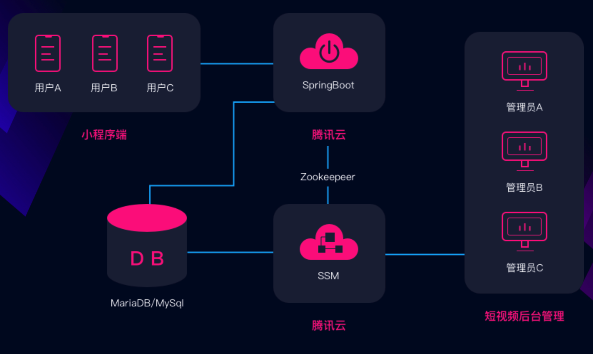

# 基于微信小程序的教学内容管理平台

在这个选题中，你需要实现一个基于微信小程序的教学内容管理平台。该教学内容管理平台，学生利用个人微信号登录微信小程序，选择课程进行课程内容的学习，采用对话式教学的思路启发学生按照问题的提示一步一步深入学习，教师可以在浏览器的网页上发布课程，编排课程内容等信息。

交互式学习典型的案例：(同一家公司的产品)
- 微信公众号：熊猫小课
- 风变编程：https://www.pypypy.cn

## 1. 系统基本功能与流程

### 1.1 功能要求

#### 1.1.1 基本功能

- 教师后台
    - 课程的内容按照对话式教学的方式
    - 教师发布课程，将课程的内容按照章节编排
    - 教师查看学生的选课，提交作业情况等等

- 学生平台
    - 微信号直接登录，完善账号信息，填写邮箱、性别、姓名、学号等个人信息
    - 学生查看平台上有哪些课程，参与课程
    - 学生参与课程后，按照对话式教学学习课程，能够记录学生的学习进度

#### 1.1.2 进阶功能

- 学生可以将对话式教学的内容收藏，并可以自己添加笔记内容

#### 1.1.3 附加说明

- 对话教学法，百度百科词条：https://baike.baidu.com/item/%E5%AF%B9%E8%AF%9D%E6%95%99%E5%AD%A6%E6%B3%95/10096847?fr=aladdin
- 交互式学习，百度百科词条：https://baike.baidu.com/item/%E4%BA%A4%E4%BA%92%E5%BC%8F%E5%AD%A6%E4%B9%A0/5268055?fr=aladdin

### 1.2 使用流程

> 注:PJ 的具体界面设计和功能安排可自由发挥。除了这些页面外，你可以根据你的场景需要添加其他页面和交互。

#### 1.2.1 学生小程序（微信）端页面

- 微信号直接登录，完善账号信息，填写邮箱、性别、姓名、学号等个人信息
- 学生查看平台上有哪些课程，参与课程
- 学生参与课程后，按照对话式教学学习课程，能够记录学生的学习进度

#### 1.2.2 教师后台（浏览器）端页面

- 课程的内容按照对话式教学的方式
- 教师发布课程，将课程的内容按照章节编排
- 教师查看学生的选课，提交作业情况等等

## 2. 技术实现

## 3. 建议

- 采用前后端分离架构；
- 前端框架不限制只能用Angular，用Vue.js、WePY、mpvue也可以或者自己选择；
- 后端编程语言限制用Java语言开发，后端框架建议用SpringBoot，SpringBoot作为后端Restful服务。

### 3.1 参考资料

- 《Java仿抖音短视频小程序开发全栈式实战项目》，https://coding.imooc.com/class/217.html
- 《three.js-打造微信爆款小游戏跳一跳》，https://coding.imooc.com/class/282.html
- 《SpringBoot+MyBatis搭建迷你小程序》，https://www.imooc.com/coursescore/945
- 《Springboot 微信小程序 – 微信登录功能实战》，https://www.imooc.com/learn/1059

### 3.2  参考技术路线

前后端分离，下面的图片仅供参考

## 4. 评分细则 

### 4.1 分数组成

- 基本功能分:即完成系统基本内容与流程，满分 100 分。 
- 进阶任务分:包括但不限于更精致的设计、场景，更好的开发部署流程、设计模式等。最多 30 分。 
- 个人工作分:根据小组分工及个人完成工作量得分。每组组员该项分数总和 30 分，根据贡献比例分摊。

个人最终得分 = 基本功能分 + 进阶任务分 + 个人工作分，值域为 [0, 160]。 

### 4.2 评分点

|功能项 | 得分项 | 最高分数|
| ------ | ------ | ------ |
| 基本功能 |小程序端页面功能| 15|
|（30分）| 教师后台页面功能 |15|
|课程内容编排 |教师和学员之间的文本对话、格式编排内容、头像、姓名 |10|
|（50分） |场景的创意、功能的完成度和交互的丰富程度| 10|
||对话框内可以创建问券，学生选择，教师查看| 10|
||在浏览器端正常保存、编辑，在小程序端正常渲染 |10|
||多用户间的交流等交互功能 |10|
|工程能力| 文档 |5|
|（30分）| 系统架构 |10|
||代码风格| 5|
||项目完整度和易用性 |10|
|附加功能 |模型、动画、场景的美观程度| 10|
|（40分）|使用 Docker 部署服务器 |10|
||将服务器部署到公有云上 |10|
||其他合理的附加功能 |10|

### 4.3 评分点说明

1. 每一项的分数取决于该项功能的完成度。完成度和可用性越好，分数越高。 

2. 项目完整度和易用性评价标准:

- A. 最低要求为必须实现并完成规定的用户功能与操作。核心功能和技术都有实现，在应用逻辑和实际操 作便捷性上可以不做考虑。
- B. 基本要求为实现并完成规定的用户功能和操作，并设计合理便捷的操作流程，系统各部分衔接过度自 然，方便使用。
- C. 进阶要求为实现并完成规定的用户功能、操作和进阶加分项，形成一套完整的可发布的应用逻辑。 A、B、C 分别对应 0 - 3 分，4 - 6 分，7 - 10 分。

3. 附加功能必须在文档中明确写出，概述该功能并描述实现原理。 

4. 项目设计文档需要至少包含:
    - 项目组织以及其中每个文件的说明。
    - 关键功能实现的细节。
    - 服务器部署配置的详细介绍。

5. 团队分工文档需要至少包含: 
    - 团队成员、分工、具体完成工作，列出每个人的贡献比例。
    - 其他你们想说明的问题。 
    
## 5. 提交

1. 提交物包含以下三项:
    - 源代码:推荐使用 Git 进行协作，提交到 GitHub 等 Git 托管平台上。 
    - 文档:推荐使用 Markdown 编写项目文档，与源代码一同提交到 Git 托管平台上。 
    - 可供访问的公网地址，以及系统的操作说明(玩法)。

2. 提交物需要压缩打包提交到 FTP 上，文件名中请包含小队所有成员的姓名与学号。 

3. 友情提示:请尽早开工，本学期只有一个 Project，临时赶工很有可能完不成。